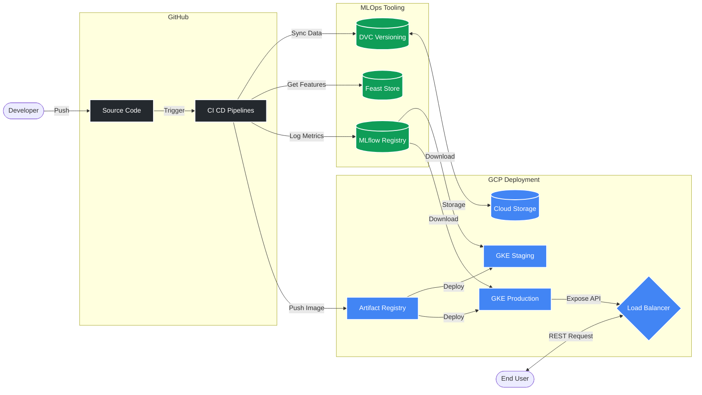

# Enterprise MLOps: Flight Pricing Prediction System

Welcome to the **Flight Pricing Prediction System**, an end-to-end, production-grade Machine Learning pipeline designed around modern MLOps principles. This repository orchestrates data versioning, feature management, model training, metric tracking, and containerized deployment natively on Google Cloud Platform (GCP).

## Overview & Key Technologies

This project implements a highly structured, scalable CI/CD architecture utilizing the following stack:
- **Google Kubernetes Engine (GKE):** Multi-environment (Staging & Production) containerized application hosting.
- **GitHub Actions:** Automated continuous integration (unit testing, metric regression checking, drift detection) and continuous deployment (Docker builds & GKE deployment).
- **DVC (Data Version Control):** Tracks large datasets, synced remotely with Google Cloud Storage.
- **Feast:** Enterprise feature store used for standardized offline feature retrieval during training.
- **MLflow:** Centralized model registry, experiment tracking, and metric logging.
- **FastAPI:** High-performance REST API serving the machine learning predictions via a Cloud Load Balancer.

## Architecture & Workflow

The following diagram illustrates the complete workflow spanning code commits, automated pipeline execution, MLOps tooling integration, and final endpoint serving on GCP.

## Setup & Reproducibility

To ensure complete reproducibility from scratch, comprehensive step-by-step guides have been provided in the `infra/` folder. These guides walk you through setting up the necessary GCP infrastructure, service accounts, MLflow cluster, and DVC remotes.

1. **[GCP Setup Guide](infra/gcp_setup_guide.md)**: Follow this to initialize the project, provision GKE clusters, set up IAM Workload Identity Federation, and execute your first end-to-end pipeline run.
2. **[GCP Teardown Guide](infra/gcp_teardown_guide.md)**: Follow this to safely destroy all provisioned GCP resources and prevent any unexpected cloud billing charges once you are finished.

## Further Steps & Future Enhancements

As the architecture evolves, the following strategic upgrades are recommended:

- **Challenger-Champion Deployments:** Implement dynamic traffic splitting (e.g., via Istio or advanced GKE ingress rules) to safely route a percentage of live traffic to newly trained "Challenger" models before fully replacing the active "Champion" model.
- **Online Feature Retrieval via Feast:** Currently, Feast is heavily utilized for robust offline training feature generation. Moving forward, the prediction API will be upgraded to integrate Feast's **Online Store** (e.g., Redis). This will allow the inference API to natively look up real-time contextual features via `get_online_features` rather than passing them raw in the prediction payload.
- **Data Drift Alerting:** Further integrate the PSI drift detection reports into a Slack or Email alerting system for automatic dataset decay notifications.
